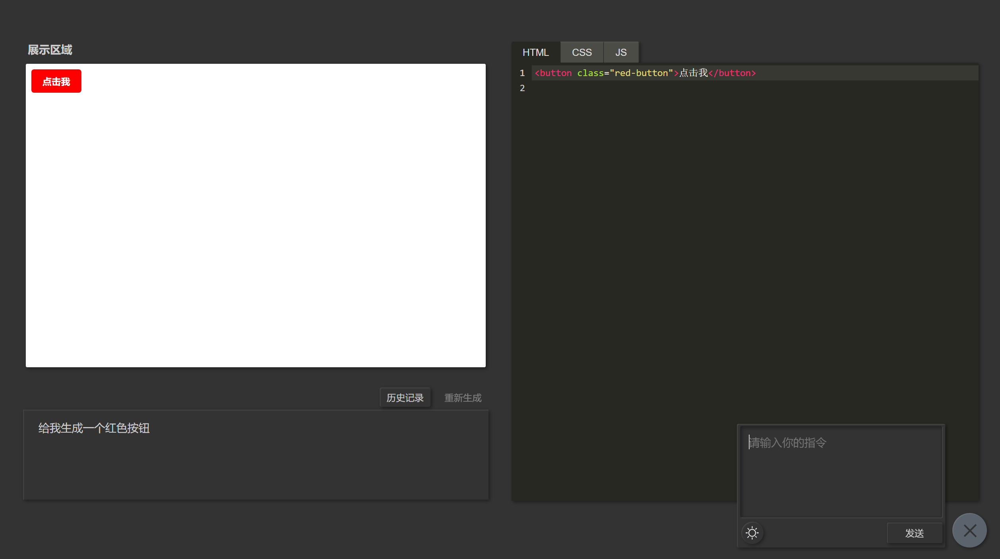

## AI CodePen

> 基于 codepen.io 思路，通过 AI 生成网页代码

+ 通过调用 OpenAI API，生成网页代码

+ 用户可以通过诸如以下命令来生成代码

    + `给我生成一个红色按钮，点击后弹出一个对话框`

    + `把之前那个红色按钮，加上一点动画效果`

    + `写个对话框`

    + ...

 

### 部署到 vercel

### 项目预览

### TODO

- [ ] 优化调用命令，使结果更加符合预期

- [ ] 在连续调用过程中，持续加强 AI 记忆

- [ ] 加强对返回代码的解析能力。若无 code 标识，因对代码内容进行进一步分析

> 若无好的 issue，UI 就这样了...
